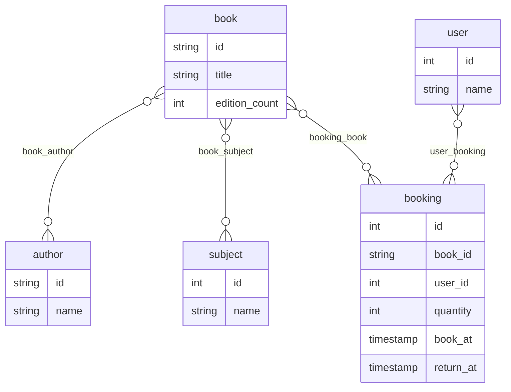
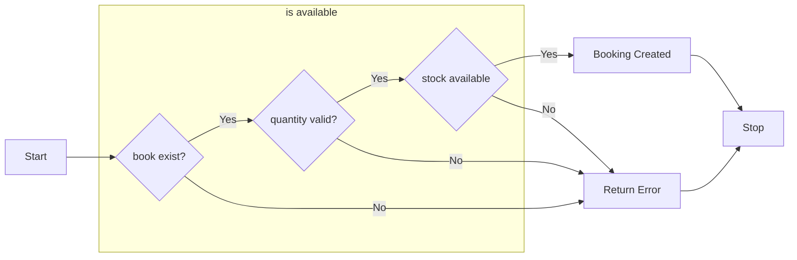

# Clean Arch Mini Project

This service for testing purposes, to make it easier to connect to other libraries will be using clean architecture

## Documentation
## Clean Architecture Guide
https://github.com/bxcodec/go-clean-arch

this service will have
1. Repository
2. Usecase
3. Domain
4. Controller

every detail that we need in the process will be added later

### API contract

testing api documentation with go swagger

https://github.com/go-swagger/go-swagger

install using brew

```
brew tap go-swagger/go-swagger
brew install go-swagger
```

serve swagger
```
swagger serve ./swagger.yaml
```

### Handler
#### echo
test http handler using echo
https://echo.labstack.com/guide/

install
```
go get github.com/labstack/echo/v4
````

### Testing tools
#### Testify
to helping assertions will using this tools
install
```
https://github.com/stretchr/testify
```


# Sample Case
## Booking System
This system will help to provide booking online

data sample will be provided by
https://openlibrary.org/dev/docs/api/subjects


the data from API will be breakdown like

for simplicity I will remove user for a while

Booking process


